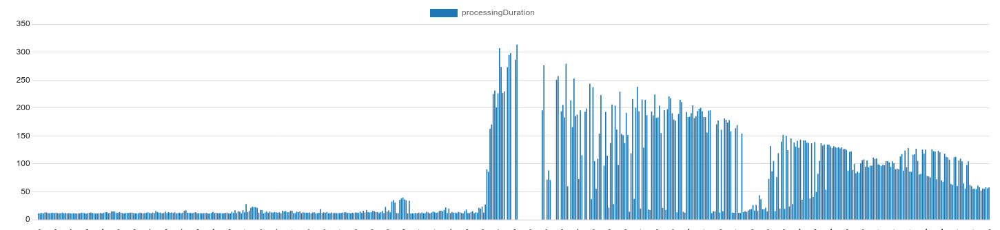

# Performance benchmarks for Neurolabs platform

In order to ensure business as usual, we have optimized for a low error rate at peaks of 100 images per second. We successfully tested our system to respond with processed images within a couple of seconds in non-peak scenarios. Our performance during peaks results in a higher processing time for images while responding in a timely manner. The highest processing time we encountered was 4.5 minutes (in the 95 Percentile) when processing 100 images per second after a continuous stream of images at 8 images per second.

## Metrics

While conducting the load tests of our software we focused on four key metrics to highlight our performance:
* Error rate
* Average processing time per image
* Time to process last image in batch 
* HTTP response time 

We tested our performance using four different scenarios that best fit the real-world usage of our system.

We use the mean, P5 (5th Percentile) and P95 (95th Percentile) to measure our timings. The P5 measurement is the time for which 5% of the requests are faster than the one reported and 95% of them are slower (an optimistic measurement), while the P95 measurement represents the time for which 95% of requests are faster and 5% are slower (a pessimistic measurement)

## Results

### Error rate

Why is this important?
* We’ve optimised for a low error rate when handling peaks of a 100img/s to ensure a business-as-usual integration of our solution.

What are the best numbers to highlight this?
* Error rate when sending 8 imgs/s for 30 seconds: **0%**
* Error rate when sending 100 imgs/s every 10 seconds: **0%**

### Average processing time per image

Why is this important?
* This shows our service response time operate within the agreed time-frame, the low processing time we have is critical for integrating our solution into your ecosystem. We highlight the average amount of time it takes to process each individual image in the batch request.

What are the best numbers to highlight this?
* Average time per image at 8 imgs/s for 30 seconds: **1.77s**
* Average with a continuous rate of 8 imgs/s with peaks of sending 100 images: **1.4s**

### Time to process last image in batch 
Why is this important?
* To complete the processing of a large batch of image, we can measure the time it takes to process the last image to have its detections computed from said batch. This metric is helpful to understand the completeness of entire batches of images, even though responses for individual images are available quicker, as highlighted by the **Average processing time per image**. We measure this as a worst-case-scenario, to showcase the longest amount of time before the final image is processed at the peak case of 100img/s. 

What are the best numbers to highlight this?
* Longest time to complete final image in a batch observed when sending a continuous stream of a random amount of images (between 8 and 100) : *** 259s in the 95th Percentile** (~4.5 minutes) 

HTTP response time 
* Why is this important?
This metric is helpful to understand the timing of our response to HTTP requests to process images. We process images in batches in an async manner, our HTTP return will be a confirmation of starting the detection process, the results will be returned in the callback request or by calling our detection API.

What are the best numbers to highlight this?
* Mean HTTP response time when sending batches of 8 images per second: **234 ms**
* Mean HTTP response time when sending random batches of images (between 8 and 100 in each batch): **262 ms**


### Scenario 1 - 8 images per second (flat)
Every second, a batch of 8 images is sent for processing. We designed this scenario as a regular load for our system. 

**Processing duration per image**

* Mean: 1.77s

**Time to process last image in batch**

* Mean: 14s
* P5: 12s
* P95: 63s


We can see a rather flat timing response, with no large spikes.

**HTTP response time ([pdf](results/flat-8.pdf))**:

* Mean: 234.64ms
* P95: 281.11ms


----

### Scenario 2 - 100 images each 10 seconds (flat)
Every 10 seconds, a batch of 100 images is sent for processing. We designed this scenario to test the peaks that can be handled by our system. 


**Processing duration per image**

* Mean: 0.87s

**Time to process last image in batch**

* Mean: 87s
* P5: 24s
* P95: 196s


We can see a rather flat timing response, with continuous processing responses. Occasional spikes, no large timing increases.


**HTTP response time ([pdf](results/flat-100.pdf))**:

* Mean: 395.15ms
* P95: 557.19ms


----

### Scenario 3 - random number of images
We send batches with a random number of images (between 8 and 100) at each second. We designed this scenario to show the robustness of our solution to a variable amount of images that require processing.

**Processing duration per image**

* Mean: 7s

**Time to process last image in batch**

* Mean: 168s
* P5: 26s
* P95: 259s


We have a flat response, with variable timing increases because of the randomness aspect of the requests.


**HTTP response time ([pdf](results/mixed.pdf))**:

* Mean: 262.24ms
* P95: 535.33ms


----

### Scenario 4 - peaks measurement
Every second, we send a batch of 8 images for processing, but for ~6% of the requests in the middle of the execution we send a batch of 100 images instead. We designed this scenario to highlight the performance of our system at the defined peak time.


**Processing duration per image**

* Mean: 1.4s

**Time to process last image in batch**

* Mean: 19s
* P5: 12s
* P95: 214s



We can observe the timing spikes during the peaks, but they are followed by a considerable decreases after and stays at optimal levels during the rest of the scenario.

**HTTP response time ([pdf](results/spike.pdf))**:

* Mean: 242.27ms
* P95: 438.98ms


----

## Replicate results

### Setup

To replicate results from this report set these environment variables:

* `API_BASE_URL`
* `API_KEY`
* `DETECTION_JOB_UUID`

### Run

Then for each scenario execute one of the following commands (replace `k6` for `k6-mac` if you're using MacOS):

```bash
./k6 run --out 'dashboard=open' mixed.js
```

```bash
./k6 run --out 'dashboard=open' flat-8.js
```

```bash
./k6 run --out 'dashboard=open' flat-100.js
```

```bash
./k6 run --out 'dashboard=open' spike.js
```

### Get the results

1. HTTP response timings will be available in open browser tab and in console output

2. Processing durations will be available at `https://app.neurolabs.ai/detection-job/${DETECTION_JOB_UUID}/performance`
The page will show graph with processing times over last hour
